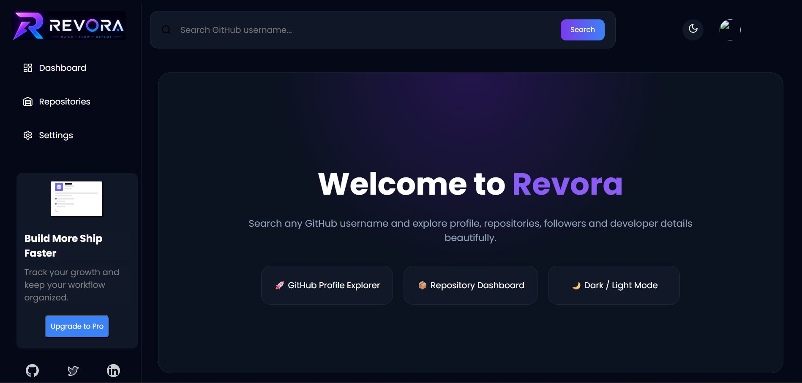
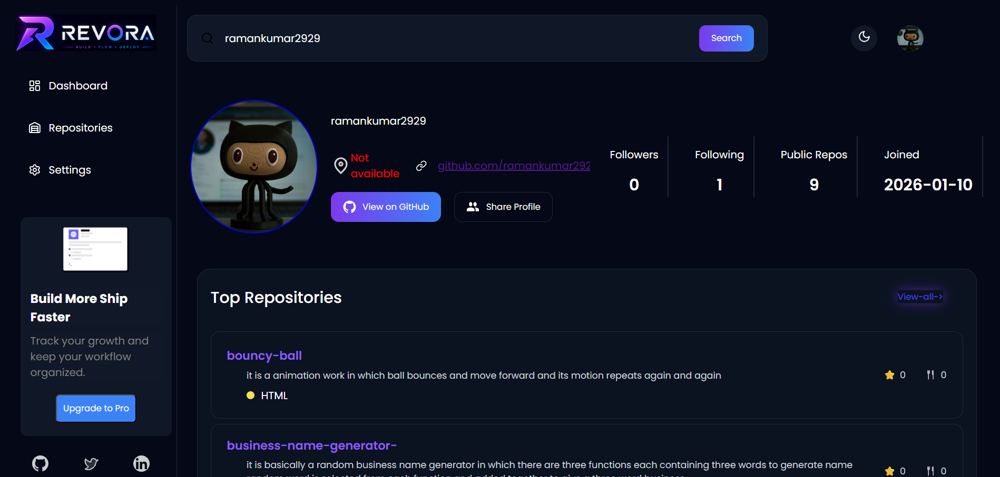
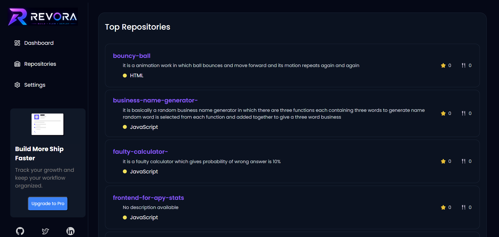
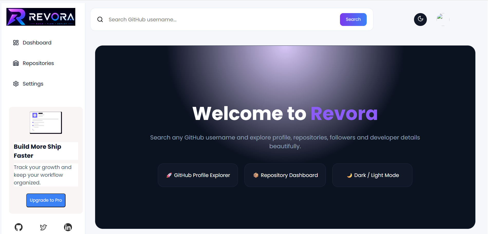
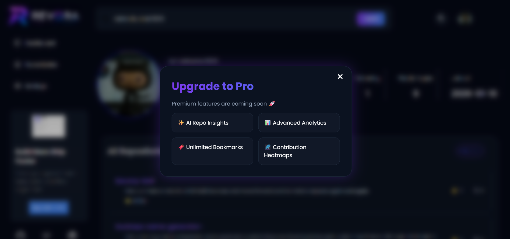
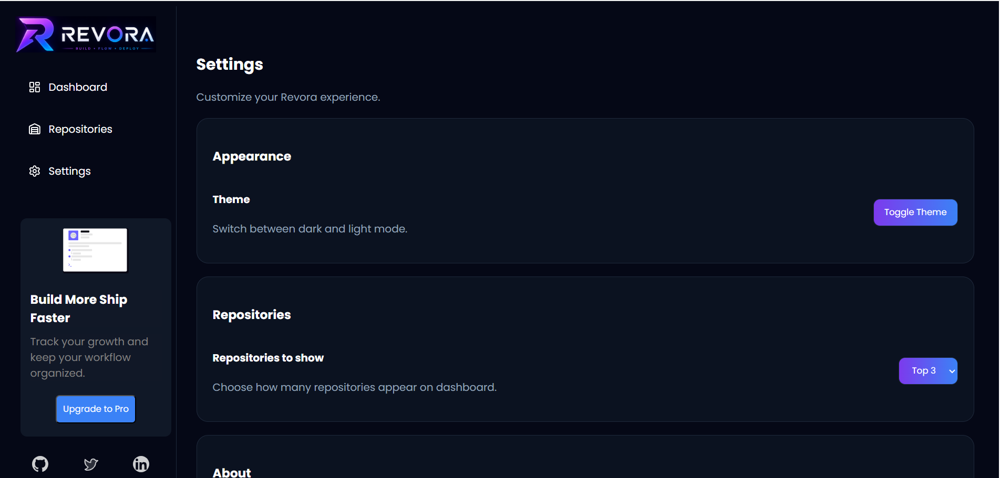

# 🚀 Revora — Modern GitHub Profile Dashboard

Revora is a modern and responsive GitHub profile dashboard that allows users to explore developer profiles, repositories, followers, repository statistics, and GitHub information beautifully using the GitHub REST API.

Designed with a clean futuristic UI, smooth interactions, dark/light mode, and responsive layouts, Revora delivers a professional developer dashboard experience directly in the browser.

---

# ✨ Features

## 🔍 GitHub Profile Search
- Search any GitHub username instantly
- Fetches real-time data from GitHub API

## 👤 Developer Profile Dashboard
- Profile picture
- Name & username
- Bio
- Location
- Followers & following
- Public repositories count
- Account joined date

## 📦 Repository Explorer
- Dynamic repository cards
- Repository description
- Primary language used
- Stars & forks count
- Direct GitHub repository links

## 🌙 Dark / Light Mode
- Fully functional theme toggle
- Smooth UI adaptation

## 📱 Fully Responsive Design
- Optimized for:
  - Desktop
  - Tablet
  - Mobile devices

## 🔗 Share Profile Modal
- Copy profile link
- Share on:
  - WhatsApp
  - Twitter/X

## ⚡ Dynamic UI Rendering
- Repositories generated dynamically using JavaScript
- Conditional rendering for empty states
- Welcome landing screen before search

## 🎨 Modern UI/UX
- Glassmorphism inspired cards
- Gradient buttons
- Clean spacing & layouts
- Smooth hover effects

---

# 🛠️ Tech Stack

- HTML5
- CSS3
- JavaScript (Vanilla JS)
- GitHub REST API

---
 # 📸 Screenshots

## Dashboard


## Profile Section


## Repositories


## Light Mode


## Upgrade Design


## Settings


---

# 🎥 Project Demo

## Live Demo
Add deployed link here

## YouTube Walkthrough
Add YouTube video link here

---

# ⚙️ Installation

Clone the repository:

```bash
git clone https://github.com/ramankumar2929/Revora.git
 

🧠 What I Learned:-
While building Revora, I learned:
API fetching using fetch()
Async/Await
Dynamic DOM manipulation
Responsive layouts
Conditional rendering
Theme switching
Modular UI structuring
GitHub REST API integration
Real-world debugging & problem solving
🌐 API Used

GitHub REST API:

https://api.github.com/

📌 Future Improvements
📈 Contribution heatmaps
📊 Repository analytics charts
🔖 Bookmark system
🤖 AI repository insights
🔐 GitHub OAuth authentication
⚡ React version of Revora


👨‍💻 Author
Raman Bishnoi
Aspiring Full Stack Developer passionate about building modern web applications and beautiful user experiences.

GitHub:
https://github.com/ramankumar2929

⭐ Support

If you liked this project, consider giving it a ⭐ on GitHub.
